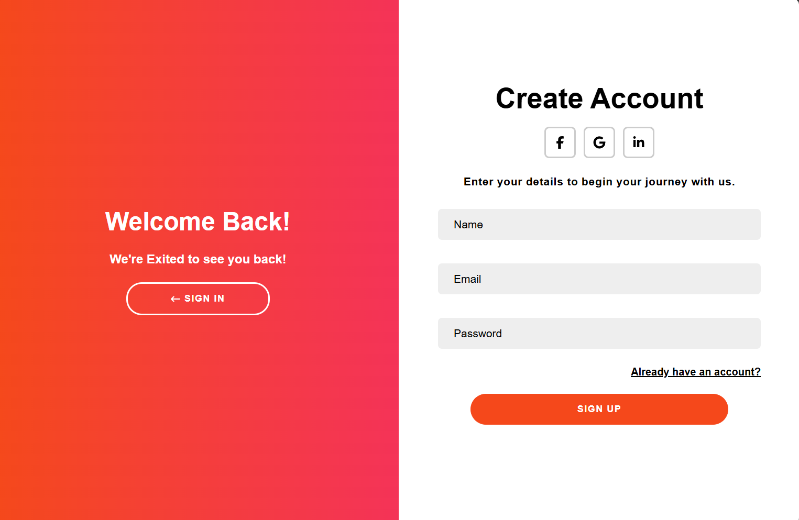
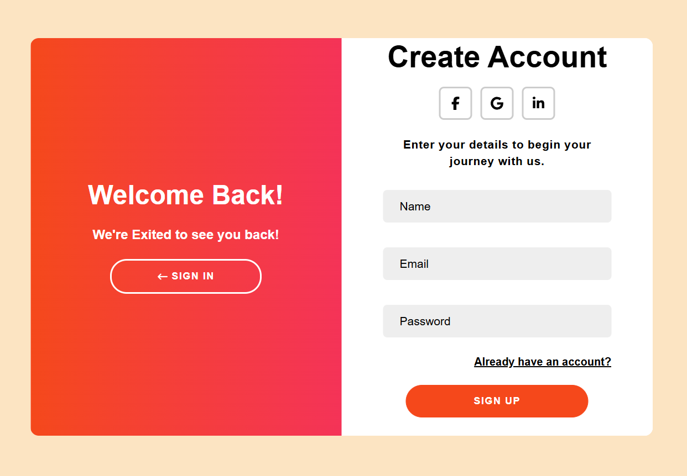
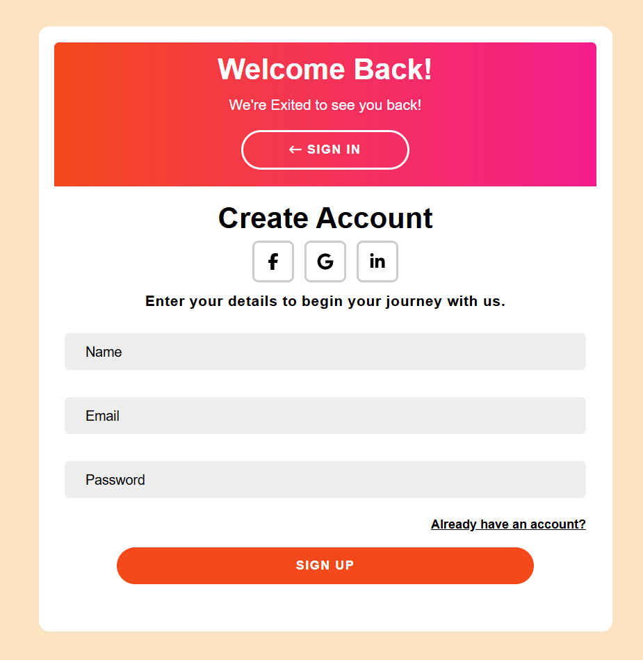

# Animated Responsive Auth UI Template (React)

A responsive login & signup UI template built with React. This template builds both sides of the user flow authentication into a single shared page. 

The template features smooth panel transitions, multiple visual modes adapted to different screen sizes, and a clean, reusable structure that supports future expansion and improvement. The project is designed as a developer-friendly template that can be easily integrated into real applications or extended with backend authentication, as all the important logic lives in the Login.CSS and Login.JSX files

Whether you're building a new project from scratch or upgrading an existing UI, this template serves as a solid foundation for creating a smooth and intuitive authentication flow.

## Preview
### FullScreen-mode

### FullScreen-mode

### Mobile-mode


## Features
* Smooth animated transitions between Login & Signup
* Multiple responsive visual modes (acomodates desktop, tablets, mobile)
* State-driven UI
* basic URL hash support
* Accessible input structure with labels and autocomplete
* CSS-driven animations using conditional class states
* No imports aside from React Icons


## Tech Stack

- React
- Vite
- CSS

## Inspiration

This project was inspired by a tutorial on how to make an "Animated Sliding Login & Signup Form" in HTML, CSS and vanila JavaScript.

I used the core idea as a starting point and extended it into a react based reusable, production-ready template with improved structure, state management, and UI flexibility.

**Original tutorial:**
https://www.youtube.com/watch?v=T9GsdKIXaVs
## Getting Started
### 1. Clone the repository

```bash
git clone https://github.com/dane679/LoginTemplate.git
cd LoginTemplate 
```

### 2. Install dependencies

```bash
npm install
```

### 3. Run the development server

```bash
npm run dev
```

### How It Works

The UI is controlled using React state:

```JavaScript
const [RPA, setRPA] = useState(false);
```

* RPA (Right Panel Active) determines which panel is visible
* CSS classes are conditionally applied based on this state
```JavaScript
 <div className={`login-container ${RPA ? "right-panel-active" : ""}`}>
```
* All animations are handled via CSS transitions
* No direct DOM manipulation is used

## Customisation
### Change Theme Colours
Use CSS variables inside the stylesheet:
```CSS
:root {
  --primary-clr: #ff4b28;
  --secondary-clr: #ff228c;
}
```

### Modify Animations

All animations are controlled in:

```
Login.css
```

Look for:
```CSS
transform
transition
```

## Support

If you found this useful, consider giving the repo a ⭐ — it helps a lot!

## License

This project is open-source and available under the MIT License.
